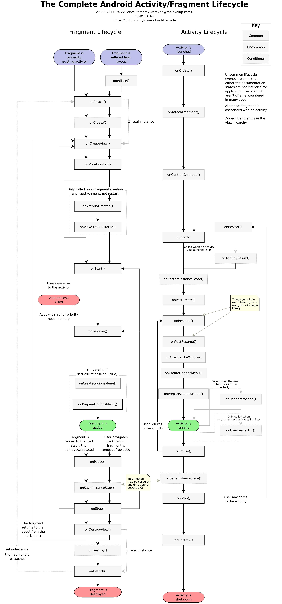
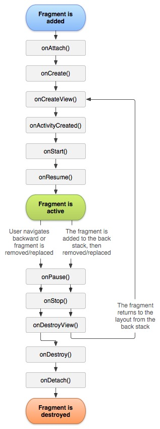
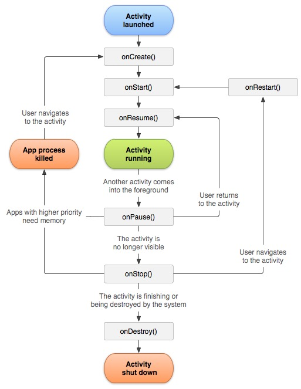
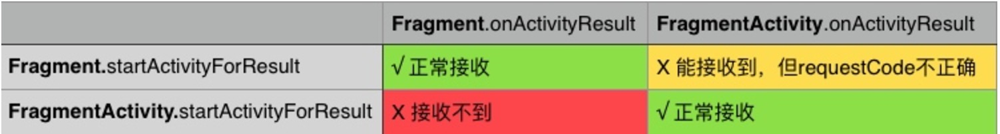

# Android Fragment与Activity

### Fragment
> 注意：常用Fragment，可能会经常遇到这样Activity状态不一致：State loss这样的错误。主要是因为：commit方法一定要在Activity.onSaveInstanceState()之前调用。

* 生命周期
* 使用静态工厂方法newInstance(...)来获取Fragment实例
* 为什么fragment会重叠？ 
> 原因是FragmentManager帮我们管理Fragment，当发生“内存重启”，他会从栈底向栈顶的顺序一次性恢复Fragment；
但是因为没有保存Fragment的mHidden属性，默认为false，即show状态，所以所有Fragment都是以show的形式恢复，我们看到了界面重叠。
（如果是replace，恢复形式和Activity一致，只有当你pop之后上一个Fragment才开始重新恢复，所有使用replace不会造成重叠现象）

### Activity

* 生命周期

### startActivityForResult的使用
> `Activity`的`startActivityForResult`和`Fragment`的`startActivityForResult`是有区别，在`Fragment`中可以通过调用`getActivity`得到`Activity`后再执行`Activity`的`startActivityForResult`方法，即可在`Fragment`对应的容器`Activity`的`onActivityResult`中接受传回来的数据。

假设有一个FragmentActivity中嵌套一个Fragment，它们各自使用startActivityForResult发起数据请求。 
经测，目标所返回结果数据，能否被它们各自的onActivityResult方法所接收的情况如下：

* `Fragment`和`FragmentActivity`都能接收到自己的发起的请求所返回的结果
* `FragmentActivity`发起的请求，`Fragment`完全接收不到结果
* `Fragment`发起的请求，虽然在`FragmentActivity`中能获取到结果，但是`requestCode`完全对应不上
* 使用`startActivityForResult`的时候，`requestCode`一定不要大于0xffff(65535)。
* 如果希望在`Fragment`的`onActivityResult`接收数据，就要调用`Fragment.startActivityForResult`，而不是`Fragment.getActivity().startActivityForResult`。

### 参考
* [Android基础：Fragment，看这篇就够了](http://mp.weixin.qq.com/s?__biz=MzA3NTYzODYzMg==&mid=2653579375&idx=1&sn=4f80a50961329e19cad6cd0e1bff20d9&chksm=84b3ba68b3c4337e28a870d6338fa3035d299a2aff2f3bf3f82304417aa7a83deab0b95031e6&mpshare=1&scene=1&srcid=1020fFlFKaeePzTtslVVpOj8#rd)
* [Android Fragment 真正的完全解析（上）](http://blog.csdn.net/lmj623565791/article/details/37970961)
* [Fragment全解析系列（一）：那些年踩过的坑](http://www.jianshu.com/p/d9143a92ad94)
* [Fragment学习](https://lijunjieone.gitbooks.io/android/content/fragmentxue_xi.html)
* [Android Fragment](https://hzj163.gitbooks.io/android-fragment/content/index.html)
* [关于 Android，用多个 activity，还是单 activity 配合 fragment？](https://www.zhihu.com/question/39662488)
* [我为什么主张反对使用Android Fragment](https://asce1885.gitbooks.io/android-rd-senior-advanced/content/wo_wei_shi_yao_zhu_zhang_fan_dui_shi_yong_android_fragment.html)
* [Android Fragment使用(一) 基础篇 温故知新](http://mengdd.github.io/Android/2016/05/31/android-fragment-usage-1-basic-part/)
* [Android Fragment使用(二) 嵌套Fragments (Nested Fragments) 的使用及常见错误](http://mengdd.github.io/Android/2016/06/02/android-fragment-usage-2-nested-fragments/)
* [彻底搞懂startActivityForResult在FragmentActivity和Fragment中的异同](http://blog.csdn.net/barryhappy/article/details/53229238)