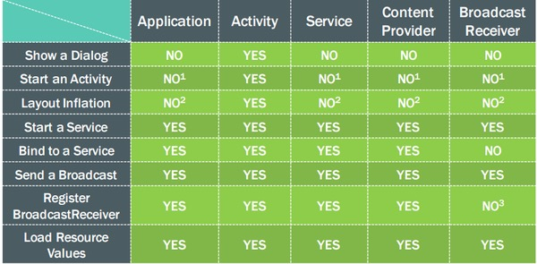

# Android一些很少使用的方法、类和Tips

### TextUtils
* isEmpty
* htmlEncode
* isDigitsOnly
* equals
* concat

### URLUtil
* isNetworkUrl
* isHttpUrl
* isHttpsUrl
* isValidUrl

### DateUtils
* formatDateTime
* isToday 判断日期是否是今天
* getRelativeTimeSpanString 返回与当前的相对时间的字符串

### HandlerThread

### 其他
* Linkify.addLinks() 这个类可以更方便的为文本添加超链接。 
* Context的使用限制
* LayoutInflater.inflate 
> 1. 调用LayoutInflater.inflate方法，并且将root参数设置为null，就等于忽略了xml布局文件中的layout_×参数
> 2. 如果root不为null，并且attachRoot=true，那么就会根据root生成一个布局文件View的LayoutParam对象，并且将这个View添加到root中去，并且返回这个root的View
> 3. 因此，最好还是使用这个代码吧：View v1 = LayoutInflater.from(this).inflate(R.layout.layout_menu_item, layout, false);

### 参考
* [awesome-android-tips](https://github.com/jiang111/awesome-android-tips)
* [Android开发时你遇到过什么相见恨晚的工具或网站？](https://www.zhihu.com/question/27140400)
* [Android开发中，有哪些让你觉得相见恨晚的方法、类或接口？](http://www.zhihu.com/question/33636939)
* [LayoutInflater.inflate方法解析](http://bxbxbai.github.io/2014/11/19/make-sense-of-layoutinflater/)