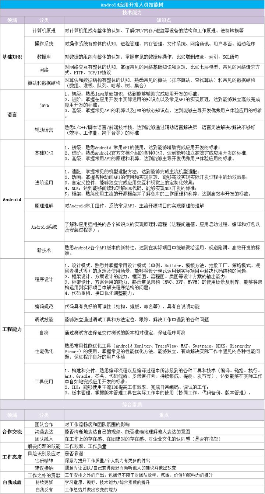

# Android知识体系

### 计算机基础

###计算机网络
* 网络分层
* IP地址
* 子网掩码及网络划分
* 重要的网络协议

### 数据结构与算法
* 树
* Hash
* 最小生成树算法
* 最短路径算法
* KMP算法
* 查找算法
* 排序算法
* 常用算法
* 数据结构和算法分析
* leetcode

### 操作系统
* 计算机体系结构
* 操作系统基础
* 并发
* 内存管理
* 磁盘与文件
* Linux系统
* 中断
* 设备管理

### 数据库系统
* 事务
* 索引
* SQL语句
* 连接

### Java
* java基础
* 重要java类源码解析
* Head First Java
* java网络编程
* java并发编程实战
* 深入理解JVM

### 设计模式
* Android源码设计模式解析与实战

### Android
* Android系统架构
* Android基础
* 数据存储
* Android测试
* NDK
* rx系列
* dagger2
* android官方架构组件
* 组件化
* 插件化
* 热更新
* android源码解析
* android优秀三方库源码解析
* 优质译文
* 学习计划
* 从小工到专家
* Android进阶之光
* Android开发艺术探索
* Android高级进阶
* Android性能优化实践

### Kotlin
* Kotlin基础

### Python
* Python基础

### Js
* Js基础

### 编程之美
* 重构，改善既有代码的设计

### 其他

### 参考
* [知识体系](https://jsonchao.github.io/knowledgehierarchy/)