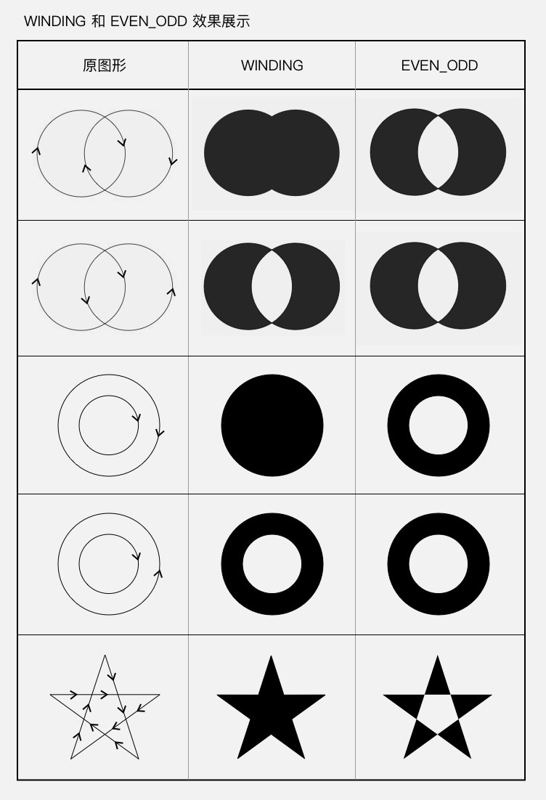

# 绘制
### 绘制基础
* 自定义绘制的方式是重写绘制方法，其中最常用的是 onDraw()
* 绘制的关键是 Canvas 的使用 
	* Canvas 的绘制类方法： drawXXX() （关键参数：Paint）
	* Canvas 的辅助类方法：范围裁切和几何变换
* 可以使用不同的绘制方法来控制遮盖关系

### Canvas
* drawColor
* drawCircle
* drawBitmap
* drawText
* drawPoint
* drawPoints
* drawOval
* drawLine
* drawLines
* drawRoundRect
* drawArc
* drawPath
	* Path 可以描述直线、二次曲线、三次曲线、圆、椭圆、弧形、矩形、圆角矩形
	* Path 方法第一类：直接描述路径。
		* 第一组：addXxx() ——添加子图形
			* addCircle(float x, float y, float radius, Direction dir) 添加圆
			* addOval(float left, float top, float right, float bottom, Direction dir) / addOval(RectF oval, Direction dir) 添加椭圆
			* addRect(float left, float top, float right, float bottom, Direction dir) / addRect(RectF rect, Direction dir) 添加矩形
			* addRoundRect(RectF rect, float rx, float ry, Direction dir) / addRoundRect(float left, float top, float right, float bottom, float rx, float ry, Direction dir) / addRoundRect(RectF rect, float[] radii, Direction dir) / addRoundRect(float left, float top, float right, float bottom, float[] radii, Direction dir) 添加圆角矩形
			* addPath(Path path) 添加另一个 Path
		* 第二组：xxxTo() ——画线（直线或曲线）
			* lineTo(float x, float y) / rLineTo(float x, float y) 画直线
			* quadTo(float x1, float y1, float x2, float y2) / rQuadTo(float dx1, float dy1, float dx2, float dy2) 画二次贝塞尔曲线
			* cubicTo(float x1, float y1, float x2, float y2, float x3, float y3) / rCubicTo(float x1, float y1, float x2, float y2, float x3, float y3) 画三次贝塞尔曲线
			* moveTo(float x, float y) / rMoveTo(float x, float y) 移动到目标位置。**moveTo(x, y) 虽然不添加图形，但它会设置图形的起点，所以它是非常重要的一个辅助方法。**
			* arcTo(RectF oval, float startAngle, float sweepAngle, boolean forceMoveTo) / arcTo(float left, float top, float right, float bottom, float startAngle, float sweepAngle, boolean forceMoveTo) / arcTo(RectF oval, float startAngle, float sweepAngle) 画弧形。这个方法和 Canvas.drawArc() 比起来，少了一个参数 useCenter，而多了一个参数 forceMoveTo。少了 useCenter ，是因为 arcTo() 只用来画弧形而不画扇形，所以不再需要 useCenter 参数；而多出来的这个 forceMoveTo 参数的意思是，绘制是要「抬一下笔移动过去」，还是「直接拖着笔过去」，区别在于是否留下移动的痕迹。
			* addArc(float left, float top, float right, float bottom, float startAngle, float sweepAngle) / addArc(RectF oval, float startAngle, float sweepAngle)又是一个弧形的方法。一个叫 arcTo ，一个叫 addArc()，都是弧形，区别在哪里？其实很简单：**addArc() 只是一个直接使用了 forceMoveTo = true 的简化版 arcTo()**。
			* close() 封闭当前子图形。不是所有的子图形都需要使用 close() 来封闭。**当需要填充图形时（即 Paint.Style 为  FILL 或 FILL_AND_STROKE），Path 会自动封闭子图形**。
	* Path 方法第二类：辅助的设置或计算
		* Path.setFillType(Path.FillType ft) 设置填充方式。FillType有四个值。

			```
			EVEN_ODD
			WINDING （默认值）
			INVERSE_EVEN_ODD
			INVERSE_WINDING
			```
			* EVEN_ODD。即 even-odd rule （奇偶原则）：对于平面中的任意一点，向任意方向射出一条射线，这条射线和图形相交的次数（相交才算，相切不算哦）如果是奇数，则这个点被认为在图形内部，是要被涂色的区域；如果是偶数，则这个点被认为在图形外部，是不被涂色的区域。
			* WINDING。即 non-zero winding rule （非零环绕数原则）：从平面中的点向任意方向射出一条射线，但计算规则不一样：以 0 为初始值，对于射线和图形的所有交点，遇到每个顺时针的交点（图形从射线的左边向右穿过）把结果加 1，遇到每个逆时针的交点（图形从射线的右边向左穿过）把结果减 1，最终把所有的交点都算上，得到的结果如果不是 0，则认为这个点在图形内部，是要被涂色的区域；如果是 0，则认为这个点在图形外部，是不被涂色的区域。
			* **WINDING 是「全填充」，而 EVEN_ODD 是「交叉填充」**，见下图。
			* INVERSE_EVEN_ODD 和 INVERSE_WINDING ，只是把这两种效果进行反转而已
			

### Paint 详解


1. **颜色类**
	* 基本颜色：Paint 设置颜色的方法有两种，一种是直接用 Paint.setColor/ARGB() 来设置颜色，另一种是使用  Shader 来指定着色方案。
		* 直接设置颜色
			* setColor(int color)。**setColor() 对应的 get 方法是 getColor()**
			* setARGB(int a, int r, int g, int b)
		* setShader(Shader shader) 设置 Shader
			* LinearGradient 线性渐变。参数tile：端点范围之外的着色规则，类型是 TileMode。TileMode 一共有 3 个值可选： CLAMP, MIRROR 和 REPEAT。CLAMP 会在端点之外延续端点处的颜色；MIRROR 是镜像模式；REPEAT 是重复模式
			* RadialGradient 辐射渐变
			* SweepGradient 扫描渐变
			* BitmapShader
			* ComposeShader 混合着色器。**使用了两个 BitmapShader 来作为 ComposeShader() 的参数，而  ComposeShader() 在硬件加速下是不支持两个相同类型的 Shader 的，所以需要关闭硬件加速。**
				* PorterDuff.Mode 一共有 17 个，可以分为两类
					1. Alpha 合成 (Alpha Compositing)
					2. 混合 (Blending)

					> 对于 Alpha 合成类的操作，掌握他们，并在实际开发中灵活运用；而对于混合类的，你只要把它们的名字记住就好了，这样当某一天设计师告诉你「我要做这种混合效果」的时候，你可以马上知道自己能不能做，怎么做。
	* setColorFilter(ColorFilter colorFilter)
		* LightingColorFilter：用来模拟简单的光照效果，LightingColorFilter 的构造方法是 LightingColorFilter(int mul, int add) ，参数里的 mul 和  add 都是和颜色值格式相同的 int 值，其中 mul 用来和目标像素相乘，add 用来和目标像素相加。
	
			```
			R' = R * mul.R / 0xff + add.R  
			G' = G * mul.G / 0xff + add.G  
			B' = B * mul.B / 0xff + add.B
			```
		* PorterDuffColorFilter：使用一个指定的颜色和一种指定的 PorterDuff.Mode 来与绘制对象进行合成。它的构造方法是
PorterDuffColorFilter(int color, PorterDuff.Mode mode) 其中的 color 参数是指定的颜色，  mode 参数是指定的 Mode。同样也是 PorterDuff.Mode ，不过和 ComposeShader 不同的是，PorterDuffColorFilter 作为一个 ColorFilter，只能指定一种颜色作为源，而不是一个  Bitmap。
		* ColorMatrixColorFilter：使用一个 ColorMatrix 来对颜色进行处理。ColorMatrix 这个类，内部是一个 4x5 的矩阵：
		
			```
			[ a, b, c, d, e,
	 		 f, g, h, i, j,
	 		 k, l, m, n, o,
	 		 p, q, r, s, t ]
			```
通过计算， ColorMatrix 可以把要绘制的像素进行转换。对于颜色 [R, G, B, A] ，转换算法是这样的：
		
			```
			R’ = a*R + b*G + c*B + d*A + e;  
			G’ = f*R + g*G + h*B + i*A + j;  
			B’ = k*R + l*G + m*B + n*A + o;  
			A’ = p*R + q*G + r*B + s*A + t;
			```
	* setXfermode(Xfermode xfermode)
		* Xfermode 注意事项
			1. 使用离屏缓冲（Off-screen Buffer），使用离屏缓冲有两种方式
				* Canvas.saveLayer()，saveLayer() 可以做短时的离屏缓冲。使用方法很简单，在绘制代码的前后各加一行代码，在绘制之前保存，绘制之后恢复
				* View.setLayerType()，View.setLayerType() 是直接把整个 View 都绘制在离屏缓冲中。  setLayerType(LAYER_TYPE_HARDWARE) 是使用 GPU 来缓冲，  setLayerType(LAYER_TYPE_SOFTWARE) 是直接直接用一个 Bitmap 来缓冲。
			
				> 如果没有特殊需求，可以选用第一种方法 Canvas.saveLayer() 来设置离屏缓冲，以此来获得更高的性能。
			2. 控制好透明区域：使用 Xfermode 来绘制的内容，除了注意使用离屏缓冲，还应该注意控制它的透明区域不要太小，要让它足够覆盖到要和它结合绘制的内容，否则得到的结果很可能不是你想要的。

	> Paint 的第一类 API——关于颜色的三层设置：直接设置颜色的 API 用来给图形和文字设置颜色； setColorFilter() 用来基于颜色进行过滤处理； setXfermode() 用来处理源图像和 View 已有内容的关系。

2. **效果类**
	* setAntiAlias (boolean aa) 设置抗锯齿，可以使用更便捷的构造方法
		
		```
		Paint paint = new Paint(Paint.ANTI_ALIAS_FLAG);
		```
	* setStyle(Paint.Style style) 用来设置图形是线条风格还是填充风格的，也可以两者兼用
	* 线条形状，设置线条形状的一共有 4 个方法：`setStrokeWidth(float width)`, `setStrokeCap(Paint.Cap cap)`,  `setStrokeJoin(Paint.Join join)`, `setStrokeMiter(float miter)`。

		> 线条宽度 0 和 1 的区别
		>
默认情况下，线条宽度为 0，但你会发现，这个时候它依然能够画出线，线条的宽度为 1 像素。那么它和线条宽度为 1 有什么区别呢？
		>
其实这个和后面要讲的一个「几何变换」有关：你可以为 Canvas 设置 Matrix 来实现几何变换（如放大、缩小、平移、旋转），在几何变换之后 Canvas 绘制的内容就会发生相应变化，包括线条也会加粗，例如 2 像素宽度的线条在 Canvas 放大 2 倍后会被以 4 像素宽度来绘制。而当线条宽度被设置为 0 时，它的宽度就被固定为 1 像素，就算 Canvas 通过几何变换被放大，它也依然会被以 1 像素宽度来绘制。Google 在文档中把线条宽度为 0 时称作「hairline mode（发际线模式）」。
		* setStrokeWidth(float width) 设置线条宽度。单位为像素，默认值是 0。
		* setStrokeCap(Paint.Cap cap) 设置线头的形状。线头形状有三种：BUTT 平头、ROUND 圆头、SQUARE 方头。默认为 BUTT。当线条的宽度是 1 像素时，这三种线头的表现是完全一致的，全是 1 个像素的点；而当线条变粗的时候，它们就会表现出不同的样子：
		
			
		* setStrokeJoin(Paint.Join join) 设置拐角的形状。有三个值可以选择：MITER 尖角、 BEVEL 平角和 ROUND 圆角。默认为 MITER。

			
		* setStrokeMiter(float miter) 这个方法是对于 setStrokeJoin() 的一个补充，它用于设置 MITER 型拐角的延长线的最大值。miter 参数是对于转角长度的限制，具体来讲，是指尖角的外缘端点和内部拐角的距离与线条宽度的比。
		
			
		
			如果拐角的大小为 θ ，那么这个比值就等于 1 / sin ( θ / 2 ) 。这个 miter limit 的默认值是 4，对应的是一个大约 29° 的锐角。
		
			> 默认情况下，大于这个角的尖角会被保留，而小于这个夹角的就会被「削成平头」

	* 色彩优化

		Paint 的色彩优化有两个方法： setDither(boolean dither) 和 setFilterBitmap(boolean filter) 。它们的作用都是让画面颜色变得更加「顺眼」，但原理和使用场景是不同的。
		
		* setDither(boolean dither) 设置图像的抖动，是指把图像从较高色彩深度（即可用的颜色数）向较低色彩深度的区域绘制时，在图像中有意地插入噪点，通过有规律地扰乱图像来让图像对于肉眼更加真实的做法。
		* setFilterBitmap(boolean filter) 设置是否使用双线性过滤来绘制 Bitmap 。

			> 以上就是 Paint 的两个色彩优化的方法： setDither(dither) ，设置抖动来优化色彩深度降低时的绘制效果； setFilterBitmap(filterBitmap) ，设置双线性过滤来优化 Bitmap 放大绘制的效果。
	
	* setPathEffect(PathEffect effect) 使用 PathEffect 来给图形的轮廓设置效果。

		PathEffect 分为两类，单一效果的  `CornerPathEffect` `DiscretePathEffect` `DashPathEffect` `PathDashPathEffect` ，和组合效果的  `SumPathEffect` `ComposePathEffect`。

		* CornerPathEffect 把所有拐角变成圆角。它的构造方法 CornerPathEffect(float radius) 的参数 radius 是圆角的半径。

		* DiscretePathEffect 线条进行随机的偏离，让轮廓变得乱七八糟。乱七八糟的方式和程度由参数决定。DiscretePathEffect 具体的做法是，把绘制改为使用定长的线段来拼接，并且在拼接的时候对路径进行随机偏离。它的构造方法
DiscretePathEffect(float segmentLength, float deviation) 的两个参数中， segmentLength 是用来拼接的每个线段的长度， deviation 是偏离量。

		* DashPathEffect 使用虚线来绘制线条。它的构造方法 DashPathEffect(float[] intervals, float phase) 中， 第一个参数 intervals 是一个数组，它指定了虚线的格式：数组中元素必须为偶数（最少是 2 个），按照「画线长度、空白长度、画线长度、空白长度」……的顺序排列。

		* PathDashPathEffect 这个方法比 DashPathEffect 多一个前缀 Path ，所以顾名思义，它是使用一个 Path 来绘制「虚线」。它的构造方法
PathDashPathEffect(Path shape, float advance, float phase, PathDashPathEffect.Style style) 中， shape 参数是用来绘制的 Path ； advance 是两个相邻的 shape 段之间的间隔，不过注意，这个间隔是两个 shape 段的起点的间隔，而不是前一个的终点和后一个的起点的距离； phase 和  DashPathEffect 中一样，是虚线的偏移；最后一个参数 style，是用来指定拐弯改变的时候 shape 的转换方式。style 的类型为 PathDashPathEffect.Style ，是一个 enum ，具体有三个值：
			
			```
			* TRANSLATE：位移
			* ROTATE：旋转
			* MORPH：变体
			```

		* SumPathEffect 这是一个组合效果类的 PathEffect 。它的行为特别简单，就是分别按照两种 PathEffect 分别对目标进行绘制。
		* ComposePathEffect 这也是一个组合效果类的 PathEffect 。不过它是先对目标 Path 使用一个 PathEffect，然后再对这个改变后的 Path 使用另一个 PathEffect。它的构造方法
ComposePathEffect(PathEffect outerpe, PathEffect innerpe) 中的两个 PathEffect 参数，  innerpe 是先应用的， outerpe 是后应用的。

			> 注意： PathEffect 在有些情况下不支持硬件加速，需要关闭硬件加速才能正常使用：
>
Canvas.drawLine() 和 Canvas.drawLines() 方法画直线时，setPathEffect() 是不支持硬件加速的；
PathDashPathEffect 对硬件加速的支持也有问题，所以当使用 PathDashPathEffect 的时候，最好也把硬件加速关了。

	* setShadowLayer(float radius, float dx, float dy, int shadowColor) 在之后的绘制内容下面加一层阴影。效果就是上面这样。方法的参数里， radius 是阴影的模糊范围； dx dy 是阴影的偏移量；  shadowColor 是阴影的颜色。
如果要清除阴影层，使用 clearShadowLayer() 。

		> 注意：
>
在硬件加速开启的情况下， setShadowLayer() 只支持文字的绘制，文字之外的绘制必须关闭硬件加速才能正常绘制阴影。
>
如果 shadowColor 是半透明的，阴影的透明度就使用 shadowColor 自己的透明度；而如果  shadowColor 是不透明的，阴影的透明度就使用 paint 的透明度。

	* setMaskFilter(MaskFilter maskfilter) 为之后的绘制设置 MaskFilter。上一个方法 setShadowLayer() 是设置的在绘制层下方的附加效果；而这个 MaskFilter 和它相反，设置的是在绘制层上方的附加效果。

		> 到现在已经有两个 setXxxFilter(filter) 了。前面有一个 setColorFilter(filter) ，是对每个像素的颜色进行过滤；而这里的 setMaskFilter(filter) 则是基于整个画面来进行过滤。
		
		MaskFilter 有两种： BlurMaskFilter 和 EmbossMaskFilter。
		* BlurMaskFilter 模糊效果的 MaskFilter。它的构造方法
BlurMaskFilter(float radius, BlurMaskFilter.Blur style) 中， radius 参数是模糊的范围，  style 是模糊的类型。一共有四种：

			```
			NORMAL: 内外都模糊绘制
			SOLID: 内部正常绘制，外部模糊
			INNER: 内部模糊，外部不绘制
			OUTER: 内部不绘制，外部模糊
			```

		* EmbossMaskFilter 浮雕效果的 MaskFilter。它的构造方法
EmbossMaskFilter(float[] direction, float ambient, float specular, float blurRadius) 的参数里， direction 是一个 3 个元素的数组，指定了光源的方向； ambient 是环境光的强度，数值范围是 0 到 1； specular 是炫光的系数； blurRadius 是应用光线的范围。

	* 获取绘制的 Path
	
		这组方法做的事是，根据 paint 的设置，计算出绘制 Path 或文字时的实际 Path。
		* getFillPath(Path src, Path dst) 方法的参数里，src 是原 Path ，而 dst 就是实际 Path 的保存位置。 getFillPath(src, dst) 会计算出实际 Path，然后把结果保存在 dst 里。
		* getTextPath(String text, int start, int end, float x, float y, Path path) / getTextPath(char[] text, int index, int count, float x, float y, Path path) 文字的绘制，虽然是使用 Canvas.drawText() 方法，但其实在下层，文字信息全是被转化成图形，对图形进行绘制的。 getTextPath() 方法，获取的就是目标文字所对应的 Path 。

* **drawText() 相关类**

	Paint 有些设置是文字绘制相关的，即和 drawText() 相关的。比如设置文字大小、文字间隔、各种文字效果
	* Canvas 绘制文字的方式

		Canvas 的文字绘制方法有三个：drawText() drawTextRun() 和 drawTextOnPath()。
		* drawText(String text, float x, float y, Paint paint) ，drawText() 是 Canvas 最基本的绘制文字的方法：给出文字的内容和位置， Canvas 按要求去绘制文字。
	
* **初始化类**

	这一类方法很简单，它们是用来初始化 Paint 对象，或者是批量设置 Paint 的多个属性的方法。
	* reset() ：重置 Paint 的所有属性为默认值。相当于重新 new 一个，不过性能当然高一些啦。
	* set(Paint src)：把 src 的所有属性全部复制过来。相当于调用 src 所有的 get 方法，然后调用这个 Paint 的对应的  set 方法来设置它们。
	* setFlags(int flags)：批量设置 flags。相当于依次调用它们的 set 方法。

### drawText() 文字的绘制

### Canvas 对绘制的辅助 clipXXX() 和 Matrix

### 属性动画 Property Animation（上手篇）

### 属性动画 Property Animation（进阶篇）

### 硬件加速