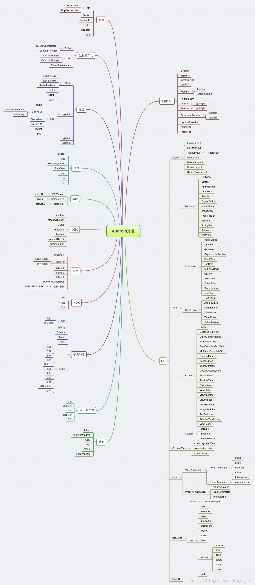

# Android知识点

### 资料
* [LearningNotes](https://github.com/francistao/LearningNotes)
* [android-open-source-project-analysis](https://github.com/guoxiaoxing/android-open-source-project-analysis)
* [BeesAndroid](https://github.com/BeesAndroid/BeesAndroid)
* [hencoder](http://hencoder.com/)
* [codekk](http://a.codekk.com/)
* [Android面试专栏](https://zhuanlan.zhihu.com/androidinterview)

### 基础知识
* Java基础
* 数据结构
* 面向对象思想
* 设计模式

### 通信
* TCP与UDP
* Http
* Socket
* 蓝牙
* NFC
* Headset
* USB
* okhttp与Retrofit

### UI
* 布局
* View
* 自定义View
* 动画
* 资源Resource
* OpenGL

### 数据持久化
* Sqlite
	* SQLiteOpenHelper
	* ContentProvider 
* File
	* Internal Storage
	* External Storage 
* SharedPreferences
* 第三方ORM工具（GreenDAO、Room、ObjectBox、Realm）

### 调试

### 性能

### 适配

### 测试

### 安全

### NDK

### 手机功能
* 电话
* 短信
* Camera
* 感应器

### 参考
* [LearningNotes](https://github.com/francistao/LearningNotes)