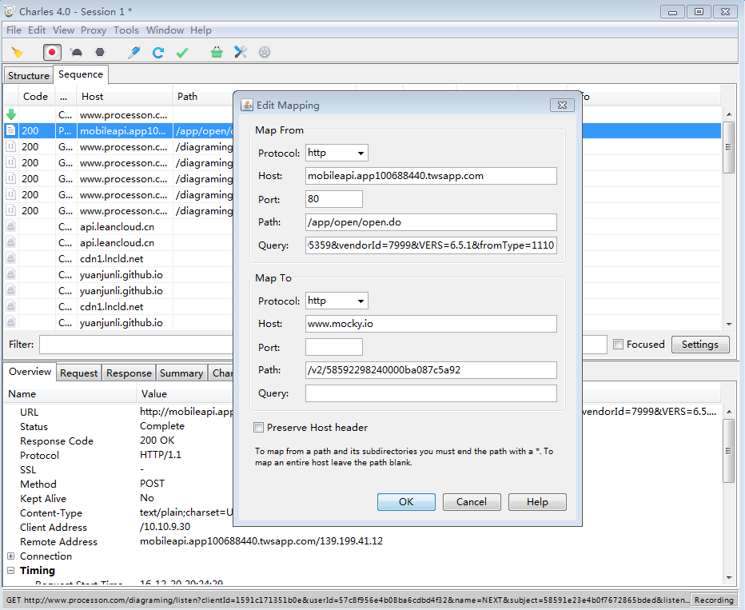

# 模拟API接口返回JSON
在APP开发中，项目开始阶段经常会遇到API接口文档定义出来，但API接口开发速度太慢导致APP进度变慢的情况。

最开始，我们使用了本地项目中创建`xxx.json`文件，然后在`Android`和`iOS`中创建一个JSON文件的加载类的方案，虽然这样可以解决数据的提供，但是还有一个就是不能真实的请求接口。在这种情况下，我们找到了一个方案，用[mocky](https://www.mocky.io/)来生成一个临时的API接口，把原先写在`xxx.json`文件中的JSON放到临时的API网络接口中，可是这样做就完美了么？显然这样在APP的接口定义中，当需要更换成我们真实的API接口时，需要改变客户端原有的代码，因为有大量的替换工作要做，要是万一替换之后，接口又出现了问题，又还得替换回模拟的API接口，一来一去就会耽误很多的时间。

那怎么解决上面的问题呢？答案是拦截我们后台真实的API接口，再转换到模拟的API接口去。在Windows上可以用`Fiddler`，Mac上可以用`Charles`。以`Charles`为例，实现的逻辑如下图

然后配置好`Charles`后，去配置所需要拦截的真实API接口和模拟API接口的映射关系，如下图

选择标题栏`Tool`工具图标，取消选择`Map Remote`,再勾选`Map Remote`，让设置的ip地址映射生效。此时，当客户端请求原地址时，都会返回模拟ip地址的数据了。

还有一个方案是使用OkHttp的拦截机制，可实现改变部分代码则可模拟返回数据。这里就不说了，看参考文章中的详细说明。

### 参考
* [模拟接口返回](http://codingpub.github.io/2016/06/22/模拟接口返回/)