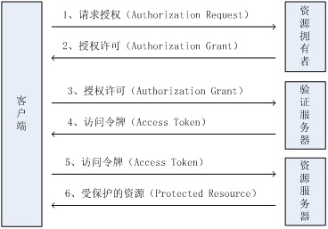

# OAuth2.0

### 什么是OAuth
> `OAuth`（开放授权）是一个开放标准，允许用户授权第三方网站访问他们存储在另外的服务提供者上的信息，而不需要将用户名和密码提供给第三方网站或分享他们数据的所有内容。

`OAuth 2.0`是行业标准的授权协议。`OAuth 2.0`取代了2006年创建的原始OAuth协议所做的工作。`OAuth 2.0`专注于简化客户开发人员，同时为Web应用程序，桌面应用程序，手机和客厅设备提供特定的授权流程。

### 授权流程和原理
使用 `OAuth 2.0` 的流程可以简单概括为：

1. 应用向后台请求授权页面。
2. 后台为用户显示一个授权页面，用户在此页面确认是否同意应用的请求。
3. 如果用户同意授权，应用会获取到一个访问令牌`access_token`，通过此令牌，应用可以访问授权用户的数据。
4. 如果访问需要授权的 `API`，请使用 `HTTPS` 协议，加上 `access_token` 的 `Header`。

整个`OAuth 2.0`的协议实现原理如下：

	1. 用户打开客户端以后，客户端要求用户给予授权。
	2. 用户同意给予客户端授权。
	3. 客户端使用上一步获得的授权，向认证服务器申请令牌。
	4. 认证服务器对客户端进行认证以后，确认无误，同意发放令牌。
	5. 客户端使用令牌，向资源服务器申请获取资源。
	6. 资源服务器确认令牌无误，同意向客户端开放资源。

不难看出来，上面六个步骤之中，2是关键，即用户怎样才能给于客户端授权。有了这个授权以后，客户端就可以获取令牌，进而凭令牌获取资源。

### OAuth的思路
`OAuth`在"客户端"与"服务提供商"之间，设置了一个授权层（authorization layer）。"客户端"不能直接登录"服务提供商"，只能登录授权层，以此将用户与客户端区分开来。"客户端"登录授权层所用的令牌（token），与用户的密码不同。用户可以在登录的时候，指定授权层令牌的权限范围和有效期。

"客户端"登录授权层以后，"服务提供商"根据令牌的权限范围和有效期，向"客户端"开放用户储存的资料。

### 客户端的授权模式
客户端必须得到用户的授权（authorization grant），才能获得令牌（access token）。OAuth 2.0定义了四种授权方式。

	* 授权码模式（authorization code）
	* 简化模式（implicit）
	* 密码模式（resource owner password credentials）
	* 客户端模式（client credentials）
详见[这里](http://www.ruanyifeng.com/blog/2014/05/oauth_2_0.html)

### 更新令牌
如果用户访问的时候，客户端的"访问令牌"已经过期，则需要使用"更新令牌"申请一个新的访问令牌。

客户端发出更新令牌的HTTP请求，包含以下参数：

	* grant_type：表示使用的授权模式，此处的值固定为"refreshtoken"，必选项。
	* refresh_token：表示早前收到的更新令牌，必选项。
	* scope：表示申请的授权范围，不可以超出上一次申请的范围，如果省略该参数，则表示与上一次一致。

### 参考
* [OAuth 2.0协议规范](https://oauth.net/2/)
* [OAuth维基百科（中文）](http://zh.wikipedia.org/zh/OAuth)
* [理解OAuth 2.0](http://www.ruanyifeng.com/blog/2014/05/oauth_2_0.html)
* [OAuth2集成](http://jinnianshilongnian.iteye.com/blog/2038646)