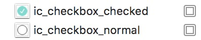
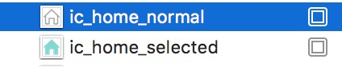
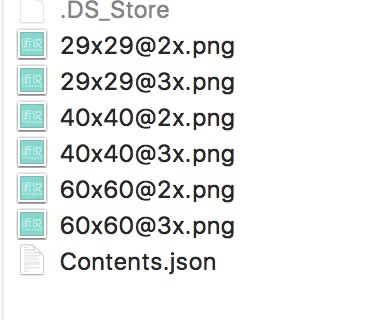
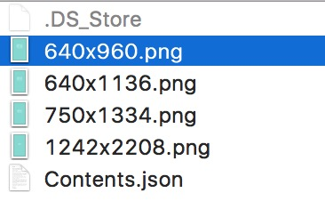

# iOS图标切图规范

## 命名
1. ic_xxx_xxx
2. bg_xx_xx
3. checkbox
4. Tab bar icon 

## 大小

### app icon
1. `29x29@2x.png` - 58x58
2. `29x29@3x.png` - 87x87
3. `40x40@2x.png` - 80x80
3. `40x40@3x.png` - 120x120
4. `60x60@2x.png` - 120x120
5. `60x60@3x.png` - 180x180

### launch image
1. `640x960.png` - 640x960
2. `640x1136.png` - 640x1136
3. `750x1334.png` - 750x1334
4. `1242x2208.png`- 1242x2208

### Tab bar icon
1. @2x 50x50
2. @3x 75x75

### Setting
1. @2x 44x44
2. @3x 66x66

### UIBarButtonItem
1. @2x 44x44
2. @3x 66x66

