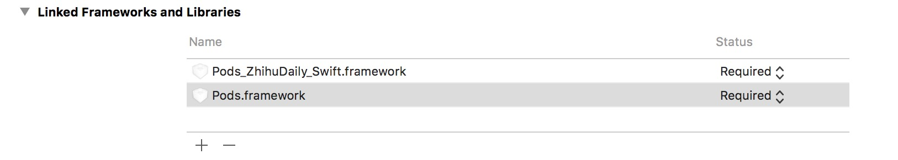
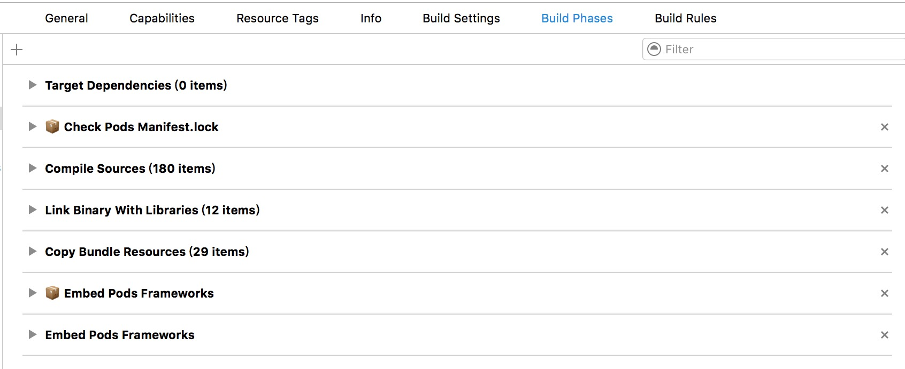
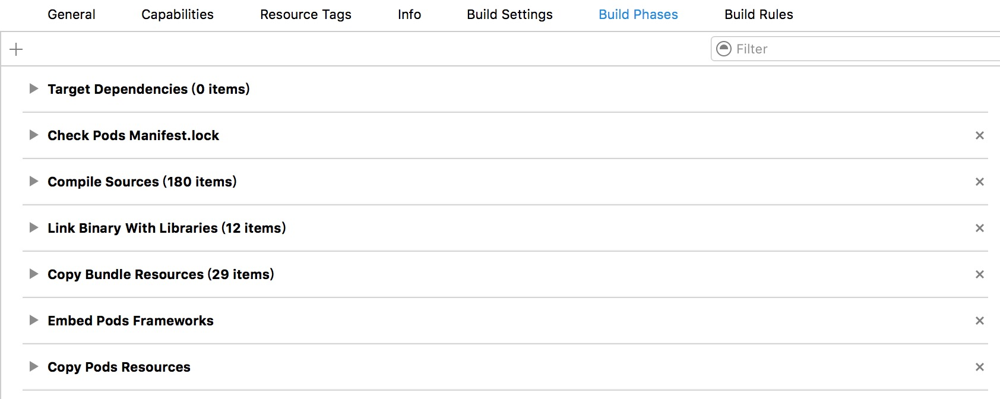

#iOS CocoaPods使用

###常用命令
* 安装podfile：`pod install`
* 快速安装（不更新spec）：`pod install --no-repo-update`
* 快速安装（不更新spec，显示debug信息）：`pod install --verbose --no-repo-update`
* 创建podspec文件：`pod spec create <name>`
* 使用pod创建模板工程：`pod lib create <name>`
* 验证本地spec文件有效性：`pod lib lint`或`pod lib lint <name>.podspec`
* 验证本地spec文件有效性（允许警告）：`pod lib lint --allow-warnings`
* 验证本地spec文件有效性（获取更多错误信息）：`pod lib lint --verbose`
* 验证远程spec文件有效性：`pod spec lint`或`pod spec lint <name>.podspec`
* 添加一个私有Spec Repo到本地：`pod repo add [SpecRepoName]［GitAddress］`
* 删除一个本地私有Spec Repo：`pod repo remove [SpecRepoName]`
* 把podspec文件推送到私有库：`pod repo push <RepoName> <name>.podspec`，如`pod repo push jcdroid JCKit.podspec`
* 删除私有Spec Repo下的某一个podspec：`只需要cd到~/.cocoapods/repos/[SpecRepoName]目录下，删掉库目录`
* 将spec文件转换成json：`pod ipc spec`
* 把podspec文件推送到CocoaPod官方库：`pod trunk push <name>.podspec`
* 更新本地pod spec repo仓库：`pod repo update <sepc repo name>`，如`pod repo update jcdroid`
* 更新本地所有的pod spec repo仓库：`pod repo update`

###CocoaPods搭建私有库
1. 在`git`仓库中创建一个`spec repo`仓库和一个`project repo`仓库
2. 使用`pod lib create <project name>`创建工程，并给工程添加远程仓库地址`git remote add origin <project repo url>`，推送master分支到远程仓库
3. 给工程打`tag`，如`git tag -a 0.0.1 -m 'v0.0.1'`，推送tag=0.0.1到远程仓库，如`git push origin 0.0.1`
4. 根据工程中的`tag version`配置工程中`<name>.podspec`文件的`version`和一些基本信息
5. 验证工程中`<name>.podspec`文件，`pod lib lint`
6. 添加远程`spec repo`到本地的`~/.cocoapods/repo/`目录下，`pod repo add <name> <spec repo url>`，如`pod repo add jcdroid https://github.com/Jcdroid/JCSpecs.git`，这时会在`~/.cocoapods/repo/`clone一份远程库的`JCSpecs`
7. 推送验证通过的`.podspec`文件到远程`spec repo`仓库，`pod repo push <name> <name>.podspec`，如`pod repo push jcdroid JCKit.podspec`
8. 成功后，使用`pod search <name>`，如`pod search JCKit`，就可以在搜索到`spec repo`仓库中的私有库了
9. 其他项目中要导入私有库，只需要在`Podfile`文件中顶部添加`source <spec repo url>`，如`source 'https://github.com/Jcdroid/JCSpecs.git'`，就可以像使用官方的库一样使用私有库，如`pod 'JCKit', '~> 0.0.1'`

####注意
1. 注意源代码的存放位置一定要和 .podspec中的 s.source 路径要一致，不然不会起作用的。 运行 pod install,也许你也注意到了，每次添加或者修改类，或者添加图片等操作，都要执行 pod install或者pod update来更新应用。
2. 如果是生成swift功能，在Podfile文件中一定要有 use_frameworks! ，这行命令是指定框框是动态框架，因为swift要求要么依赖全部是动态框架，要么全部不是，所以如果注释掉，会报编译报错； 
3. 添加完源代码之后，如果要在demo工程中引用，发现是引用不到的，原因就是你必须要把类库加入到demo工程中才行，默认在Podfile文件中生成的类库是动态类库，即 .framework的。修改成.a类库的方法就是在 Podfile中，把#use_frameworks! 注释掉就行了，这行代码默认就是生成动态类库的。 
4. 每次修改了源代码之后，需要执行`pod update --no-repo-update`，否则会报错。

###CocoaPods管理本地库

###打包静态库插件（cocoapods-packager）
* 安装：`gem install cocoapods-packager`
* 使用：`pod package <name>.podspec`

### 常见错误
1. 在`swift`工程中使用`cocoapods`时，引用导入的第三方库时出现`Pod Error in Xcode “Id: framework not found Pods”`的错误？
> 在`Project`-`Target`-`Linked Frameworks and Libraries`中删除`Pods.frameworks`，然后再点击`+`号添加第三方的`framework`，`clean`后进行`build`，如果还是不行，重启`Xcode`参考[这里](http://stackoverflow.com/questions/31139534/pod-error-in-xcode-id-framework-not-found-pods)

2. 出现类似这样的错误`Could not find a storyboard named 'QBImagePicker' in bundle`
> 这是由于cocoapods生成项目时出现了问题，下面是引起错误时的`Build Phase`
> 
> 点击右侧`X`后，在folder中删掉cocoapods生成的文件，执行`pod install --no-repo-update`可生成新的xcworkspace项目，打开后，可看到这个是正确的状态，如下图
> 

###参考
* [使用Cocoapods创建私有podspec](http://blog.wtlucky.com/blog/2015/02/26/create-private-podspec/)
* [CocoaPods创建私有Pods](http://www.liuchungui.com/blog/2015/10/19/cocoapodschuang-jian-si-you-pods/)
* [使用CocoaPods开发并打包静态库](http://www.cnblogs.com/brycezhang/p/4117180.html)
* [Cocoapods打包静态库插件](https://github.com/CocoaPods/cocoapods-packager)
* [Developing private static library for iOS with CocoaPods](http://blog.sigmapoint.pl/developing-static-library-for-ios-with-cocoapods/)
* [Private Pods](https://guides.cocoapods.org/making/private-cocoapods.html)
* [CocoaPods/Specs](https://github.com/CocoaPods/Specs)
* [如何用cocoaPod发布框架](http://andrew-anlu.github.io/blog/2016/03/15/ru-he-yong-cocoapodfa-bu-kuang-jia/)