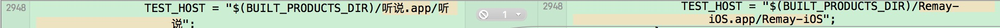
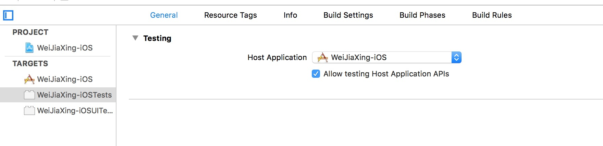

#iOS单元测试
---
2016年1月21日 上午10:58

* 传统开发：`编写程序->设计测试测试用例->编写测试用例程序->单元测试->编写测试报告`
* 测试驱动开发：`设计单元测试用例->编写测试用例程序->程序编码->单元测试->编写测试报告`

既然要写测试，那么就需要用到框架，经过Google的搜索查询到一些资料，iOS常见的测试框架有Apple提供的`XCTest`和第三方的`GHUint`。然后搜集到一些知名开源库的测试框架使用情况如下图所示

图中所有的开源库都用到了`XCTest`，所以我的测试中也选用`XCTest`。

###为什么不喜欢单元测试？
1. 不知道需要测试些什么，哪些地方需要测试？

	不应该关注于测试，而应该关注行为，应该测试行为。
		
2. 感觉测试会拖慢进度

3. 有些类很难写测试

###BDD vs TDD
1. BDD（Behavior Driven Development），也就是行为驱动开发，它旨在解决具体问题，帮助开发人员确定应该测试些什么。
2. TDD（Test-Driven Development），就是测试驱动开发，通过测试来推动整个开发的进行

###XCTest
1. 继承`XCTestCase`来创建测试用例，命名以Tests结束
2. 测试方法使用test开头
3. 点击播放小按钮可以进行单个测试，`Cmd+U`可以执行全部的测试

###OCMock
由于XCTest并没有mock对象的功能，所以需要引入`OCMock`框架。

###Expecta
`Expecta`是第三方的断言框架，不过`XCTest`自带有断言

###Objection

###iOS Snapshot TestCase
#####Creating a snapshot test
1. Subclass FBSnapshotTestCase instead of XCTestCase.
2. From within your test, use FBSnapshotVerifyView.
3. Run the test once with self.recordMode = YES; in the test's -setUp method. (This creates the reference images on disk.)
4. Remove the line enabling record mode and run the test.

###Quick + Nimble
* 明确区分出初始化与验证步骤中有哪些需要被测试
* 关注点集中在测试历史记录和必须的测试步骤上

###代码覆盖率
Xcode提供了很好的查看代码覆盖率的工具。首先打开`Edit Scheme`-`Test`-勾选`Gather coverage data`，再次运行测试，选中最后一次`Test`，选择Coverage即可查看本次运行测试整体的代码覆盖率情况

### 常见错误
* 运行`test case`时出现下面的错误
> ld: file not found: /Users/MacBookPro/Library/Developer/Xcode/DerivedData/Social_Events-cfnteabiivwfdzcoulzznhmgobhy/Build/Products/Debug-iphoneos/Social_Events.app/Social_Events
clang: error: linker command failed with exit code 1 (use -v to see invocation)

**原因**：这个错误的原因是修改了工程的`Product Name`，而`Test Host`

**解决办法**：`Project` - 选中`Target 
xxx-iOSTest` - `General` - `Testing` - `Host Application`，下拉选项选中自己的工程，如下图所示

###参考
* [objccn测试](http://objccn.io/issue-15/)
* [OCMock](http://ocmock.org/)
* [OCMock基本使用](http://iosapp.me/blog/2014/06/09/ocmock/)
* [OCMock常见使用方式](http://zixun.github.io/blog/2015/04/16/iosdan-yuan-ce-shi-xi-lie-yi-ocmockchang-jian-shi-yong-fang-shi/)
* [TDD的iOS开发初步以及Kiwi使用入门](http://onevcat.com/2014/02/ios-test-with-kiwi/)* 
* [Kiwi Github](https://github.com/kiwi-bdd/Kiwi)
* [iOS单元测试](https://harrieschen.com/ios-unit-test/)
* [iOS开发中的测试框架](http://www.jianshu.com/p/7e3f197504c1)
* [iOS单元测试编码规范](http://zixun.github.io/blog/2015/04/16/iosdan-yuan-ce-shi-xi-lie-dan-yuan-ce-shi-bian-ma-gui-fan/)
* [iOS单元测试框架选型](http://zixun.github.io/blog/2015/04/11/iosdan-yuan-ce-shi-xi-lie-dan-yuan-ce-shi-kuang-jia-xuan-xing/)
* [Xcode 7 UI 测试初窥](http://onevcat.com/2015/09/ui-testing/)
* [截图测试-ios-snapshot-test-case](https://github.com/facebook/ios-snapshot-test-case)
* [KIF](https://github.com/kif-framework/KIF)
* [ld: file not found: linker command failed with exit code 1](http://stackoverflow.com/questions/26665196/ld-file-not-found-linker-command-failed-with-exit-code-1-use-v-to-see-invoca)