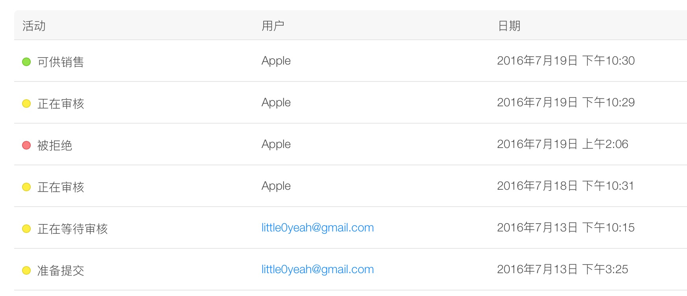

# iOS证书、真机调试、打包笔记、AppStore发布审核

### 打包流程
> 前期准备

1. 在`develop`分支上使用
2. 推送`develop`到git仓库，并合并`develop`到`master`
3. 切换到`master`分支，先检查`Code Signing Identity`和`Provisioning Profile`是否正确
4. 如果正确，就修改`master`分支对应的`Version`和`Build`后执行`git commit -m "AppStore发布版（version = 1.x.x, build = x）"`以保存新版本的信息
5. 然后在`master`分支中执行`git tag -a v1.x.x -m "微信v1.x.x AppStore发布版"`创建tag，并执行`git push origin v1.x.x`到git仓库
6. 最后推送`master`到git仓库

> 打包正式开始

1. 确认`Edit Scheme`中`Archive`中的`Build Configuration`是`Release`模式
2. `Device`选中`Generic iOS Device`，执行`Product Archive`，并等待打包
3. 打包好后，执行`export`，导出包后，在`iTunes Connect`中创建好对应的版本和更新描述，然后使用`ApplicationLoader`上传`ipa`包

### 测试打包和发布打包
* 测试打包：直接使用生成的app包打包即可，不用archive打包方式。**注意：在使用`iOS Team Provisioning Profile`描述文件生成app包时，如果添加新设备的UDID，需要先把以前的`iOS Team Provisioning Profile`描述文件删除，然后在Account - View Details - Provisioning Profiles中重新导入**，这时就可以在新设备上安装测试包了，也可以去`Certificates, Identifiers & Profiles`上查看`iOS Team Provisioning Profile`描述文件的Devices数量，如下图
* 发布打包：使用archive方式打包

### 证书
iOS分为开发和发布证书

### 真机调试
> 注意真机调试只能使用开发证书才能执行，否则会出现`The executable was signed with invalid entitlements`错误。

1. 添加iPhone的uuid到`Member Center`；
2. 在对应的开发描述文件中配置好证书和设备。

### 多机共享账号
1. 根据证书创建p12交换文件（可以不设置密码）共享到其他Mac；
2. 在`Member Center`根据对应的证书生成`mobileprovision`描述文件共享到其他Mac，通常可以直接使用通用的描述文件`iOS_Team_Provisioning_Profile_.mobileprovision`；
3. 如需要推送服务，只需要分享者在`Member Center`配置就行，不需要发送推送证书给除了集成的推送平台之外的第三方的人。

### 打包

#### 非本地Team
1. release
2. 检查team，设置为none
3. 添加mobileprovsion
4. applicationloader
5. 注意：需要拨出手机，显示iOS Device，并在release的时候检查Code Signing的Provisioning Profile

#### ipa的4种打包方式
XCode7开始提供四种证书选择，如下图

1. Save for iOS App Store Deployment
> 该方式必须使用$99的公司账号或者个人账号。通过该账号下的Distribution描述文件关联Production证书。使用该方式打包的IPA只能用于提交AppStore或者越狱的设备安装，该选项一般很少选择，因为如果要提交App Store不需要”Export”，可以直接选择Upload to App Store…。

2. Save for Ad Hoc Deployment
> 该方式也必须使用$99美元的公司账号或者个人账号。通过该账号下的Distribution描述文件关联Production证书。该方式打包的IPA可以在App Store之外使用。意思就是非越狱的设备也能够安装，但是前提是该设备的UDID已经添加到开发者账号所在的组中。保存到本地 准备在账号添加的可使用设备上使用（具体为在开发者账户下添加可用设备的udid），该app包是发布证书编译的（The app will be code signed with the distribution certificate）**如果添加的新的udid，新添加的设备好像可以直接安装，不需要重新安装，因为在develop中心添加完udid后，并不需要select新的device**

3. Save for Enterprise Deployment
> 该方式需要使用$299美元的企业账号，该方式打包的IPA适用性最强，可以在任意一台iOS设备上安装。但是也不能因为没有限制，就将其代替提交App Store直接发布给用户使用。肆意的安装可能会遭到封号。

4. Save for Development Deployment
> 针对内部测试使用，主要给开发者的设备(具体也是在开发者账户下添加可用设备的udid)。该app包是开发证书编译的。（The app will be code signed with your development certificate）**如果添加的新的udid，需要给测试证书select选的device，然后再Xcode中重新download证书，使用新证书重新打包后新添加的设备才能安装**

#### 账号类型
|账号类型	|价格|	可以发布AppStore?|	支持安装设备数量| 证书类型|
|:---:|:---:|:---:|:---:|:---:|
|个人账号|	$99	|可以	|100	|Ad Hoc, App Store|
|公司账号	|   $99	|可以	|100	|Ad Hoc, App Store|
|企业账号	|$299	|不可以	|无限制	|Ad Hoc, In House|
|教育账号|	$0	|可以	|100	|Ad Hoc, App Store|

### 命令行打包
[iOS Xcode命令行打包](iOS Xcode命令行打包.md)

### 企业证书
不受UUID的限制，但是个人和公司证书，需要提供UUID

#### 企业证书重签名
> 完整的重签名`shell`脚本，[在这里](../files/anewsign.sh)
> 
> 1. 需要把里面的`<name>`和`new name`改为你需要重签名的`ipa`名字和重签名后的`ipa`名字；
> 2. 把重签名需要用的描述文件更名为`embedded.mobileprovision`；
> 3. 还需要下载[entitlements.plist](../files/entitlements.plist)并修改其中的`pplication-identifier`、`keychain-access-groups`
> 4. 最后把`anewsign.sh`、`ipa`、`mobileprovision`、`entitlements.plist`放在一个目录下执行`anewsign.sh`就可以自动生成重签名的`ipa`。

1. 解压：`unzip <name>.ipa`
2. 删除：`rm -rf Payload/<name>.app/_CodeSignature`
3. 更换描述文件：`cp embedded.mobileprovision Payload/<name>.app/embedded.mobileprovision`
4. 重签名：`codesign -f -s "iPhone Distribution: TEST Electronics Co., Ltd. (6AP32F8XFF)" --entitlements entitlements.plist --resource-rules Payload/Remay-iOS.app/ResourceRules.plist Payload/<name>.app`
5. 压缩成ipa包：`zip -r <new name>.ipa Payload`

### 获取AppStore应用的IPA包
在iTunes中下载IPA，然后用Finder查看即可。
[如何获取AppStore应用的IPA包](http://www.jianshu.com/p/4ee125401340)

### 无账号密码时，使用Archive生成的.xcarchive包打包
1. 把.xcarchive更改为.ipa
2. 把更名后的.ipa包拖拽到iTunes中
3. 再从iTunes中拖拽到桌面就可以得到ipa包，或者右键`在Finder中显示`即可看到ipa包

### 制作越狱iOS设备IPA包
1. 将运行目标选为iOS Device;
2. xcode->product->Edit Scheme->Run xxx.app->Build Configuration设置为Release;
3. xcode->product->archive,此时project->Build Settings->code sign需要为有效的profile,才能成功;
4. Orgnizer->Archives->Distribute->Export as Xcode Archive,选择存储路径，保持此归档文件（假如此归档文件的名字是AAA）；
5. 将AAA文件显示包内容，Products->Application目录下为xxx.app;
6. 创建一个名字为Payload的目录，将xxx.app拷贝到此目录；
7. 在Payload同级目录下制作iTunesArtwork（安装在ios上的桌面图标）和iTunesMetadata.plist（一些appstore购买信息）.方法:找到一个从appstore下载下来的ipa包，将其后缀改成.zip，然后双击解压便可找到这两个文件,最后将这两个文件拷贝进Payload同级目录便可;
8. 将Payload、iTunesArtwork和iTunesMetadata.plist一并压缩，则会得到文件"归档.zip";
9. 将"归档.zip"改成xxx.ipa，xxx.ipa和上面的xxx.app，前缀需一样;
10.用91手机助手，将xxx.ipa包装进越狱ios设备中。
[制作越狱iOS设备IPA包](http://www.cnblogs.com/ouyangfang/archive/2013/02/21/2921146.html)

### 提交准备
1. 首先在`iTunes Connect`中创建app，访问[iTunes Connect](https://itunesconnect.apple.com)，使用你的`iOS`开发者账号登陆，点击右边的`Manage Your Apps`，点击左上角的`Add New App`，选择`iOS App`，然后完成表格。（注意，创建时填的APP就是你开发的项目，名称和`ID`一定要相同）。
2. 提交`1024x1024无圆角`图标，模拟器截图上传到`iTunes Connect`。提交APP截屏图片，分别为3.5寸(iPhone4s模拟器截取)、4寸(iPhone5模拟器截取)、4.7寸(iPhone6模拟器截取)、5.5寸(iPhone6Plus模拟器截取)，注意截屏的时候`Window-Scale`为100%，按`command+1`就会切换到scale=100%。
3. 提交**应用介绍文字**、**价格与销售范围**(一般应用价格为0，销售范围：所有地区，批量购买计划：没有折扣，Bitcode 自动重新编译：勾选请勿使用Bitcode自动重新编译）
4. `Xcode`打包`ipa`，在`Organizer`上传`ipa`到`AppStore`，或者使用`ApplicationLoader`来上传ipa。**在上传之前，并不需要先在`iTunes Connect`中创建对应版本的APP，不创建也是可以上传ipa的，这样就可以节省ipa上传完的等待`Build`版本6~8分钟的时间了**
5. 二进制`ipa`文件上传完成后，需要等待6~8分钟左右时间，才会在`iTunnes Connect`的`构建版本`处可供选择，此时选中一个`ipa`后即可点击`提交以供审核`，进入下图所示，如没进行`加密`和`广告`，则都选择`否`，然后点击提交后等待苹果的审核。

6. 新应用上架审核时间大概7天，应用版本更新审核时间大概3天。
7. 审核通过后，需要手动发布，如图所示

#### ApplicationLoader
使用ApplicationLoader上传时，如果你的苹果账号没有上传APP的bundle id，则会出现下面的错误

### 提交审核加急
1. 地址见[这里](https://developer.apple.com/contact/app-store/?topic=expedite)

### AppStore发布审核
1. 遇到元数据被拒绝，要不要提交以供审核？ 
> 只要回复`Apple`发过来的邮件中的问题就行，不需要点击提交以供审核，大概需要等待2天。我大概等待2天不到。期间`iTunes Connect`中一直显示着元数据被拒的小红点，不要急，等待几天就行了。
2. 遇到二进制文件被拒绝，要不要提交以供审核？如图
> 和第一个问题一样，只要回复`Apple`发过来的邮件中的问题就行，不需要点击提交以供审核，这次在一天之内就审核通过了。
3. 点击发布后，iTunes中APP状态为“可供销售”，但是在AppStore搜索不到
> 请先等待10分钟~24小时不等，24小时后还搜索不到，可以去邮件联系苹果。

### 审核被拒常用英文
* 需要重新打包上传时：I see. This issue is my code error and I will upload a new binary to fix this issue.
* 数据上的错误引起crash，不需要重新打包时：I see. This issue is caused by our server to return data errors, has now been repaired.
Please re-review, thank you.

### 问题
1. 钥匙串中显示此证书的签发者无效？
> a. 按照你那个链接下载，https://developer.apple.com/certificationauthority/AppleWWDRCA.cer，并安装。
> b. 在keychains里选择login,然后点选Certificates，在这个界面，选择工具栏的View -> Show Expired Certificates，这时候你会发现一个过期的“WWDR Certificate”（Apple Worldwide Developer Relations Certification Authority），删除它。
> c. 在System的那一栏也有这个过期的“WWDR Certificate”，一并删除它。
> d. 不出意外你的证书那里从 “This certificate has an invalid issuer”（此证书的签发者无效）变成了 “This certificate is valid”了。

2. Your build settings specify a provisioning profile with the UUID “”, however, no such provisioning profile was found
> 可以Clean后重试，或者加上关闭Xcode。

3. An App ID with Identifier 'com.XXX.XXX’ is not available. Please enter a different string.
> APP ID取名的问题，需要在`Member-Identifiers`中使用这种格式`XC com mzy chentong`，见[link](http://stackoverflow.com/questions/20565565/an-app-id-with-identifier-is-not-available-please-enter-a-different-string/36343710#36343710)

4. Code Sign error: No matching provisioning profile found: Your build settings specify a provisioning profile with the UUID “xxx”, however, no such provisioning profile was found.
> **重启Xcode**，同问题2

5. Cannot generate iOS App archive in xcode？如图
> 见[这里](http://stackoverflow.com/questions/10715211/cannot-generate-ios-app-archive-in-xcode)
> 
> Check Build Settings:
> 
> 1. Skip install is NO for the main project target
> 2. Skip install is YES for framework (sub-projects) targets
> 3. In Build Phases for sub-projects, Copy Headers needs to be in Project, not Public (does not apply if building static library)
> 4. Installation Directory under Deployment is valid (/Applications for example)
> 
> **most importantly: in each library your project uses go to build phases -> Copy Files and ensured that destination is changed from Absolute path to products directory. Note: see the hint below to narrow your search to find the library causing this error.**（最后是靠这个方法解决的，详细见[这里](http://stackoverflow.com/questions/10715211/cannot-generate-ios-app-archive-in-xcode#15120144)）

6. 上传ipa到AppStore出错，具体错误：Unexpected CFBundleExecutable Key. The bundle at 'Payload/xxx.app/EaseUIResource.bundle' does not contain a bundle executable. If this bundle intentionally does not contain an executable, consider removing the CFBundleExecutable key from its Info.plist and using a CFBundlePackageType of BNDL. If this bundle is part of a third-party framework, consider contacting the developer of the framework for an update to address this issue，如图
> 全局搜索info.plist，删除掉CFBundleExecutable对应的key和value，一定要把相关info.plist的CFBundleExecutable对应的key和value都删除掉，否则还是会报上面的错误。可参考[这里](http://stackoverflow.com/questions/32096130/unexpected-cfbundleexecutable-key#32502927)

7. 上传ipa到AppStore出错，具体错误：
> 已经上传过了同一ipa到iTunes了。

8. 运行项目时出现下面的错误，如图
> 卸载已安装的APP，重新运行项目即可

9. Xcode8打包APP上传到iTunes后，不出现在构建版本中
> 因为iOS10以后Apple更注重保护用户权限,在任何需要使用设备权限的地方都需要提前声明，如加上对应的相机和相册权限声明。见[这里](http://blog.csdn.net/qxuewei/article/details/52790357)

10. 真机运行出现，`This application's application-identifier entitlement does not match that of the installed application. These values must match for an upgrade to be allowed.`，具体如下图：
> 由于这台真机上安装了另一个描述文件编译的同一个ipa，卸载再安装即可

11. 打包ipa时，需要特别注意，**最后导出时不要勾选下图的选项**，这样会增大ipa包大小，而且它们还需要一些额外的权限，如相册权限

### 参考
* [iOS 开发流程笔记](https://github.com/leecade/ios-dev-flow)
* [IOS应用程序发布到苹果APP STORE完整流程使用教程](http://www.asotops.com/article-11-1.html)
* [此证书的签发者无效解决办法](http://stackoverflow.com/questions/32821189/xcode-7-error-missing-ios-distribution-signing-identity-for)
* [App Store审核总结](http://www.devlizy.com/appstoreshen-he-zong-jie/)
* [IPA的4种打包方式](http://blog.csdn.net/joneos/article/details/49431885)
* [Xcode 7.2 no matching provisioning profiles found](http://stackoverflow.com/questions/34346436/xcode-7-2-no-matching-provisioning-profiles-found)
* [iOS-Xcode上传后iTunes Connect构建版本不显示](http://blog.csdn.net/qxuewei/article/details/52790357) 
* [AppStore - App status is ready for sale, but not in app store](http://stackoverflow.com/questions/24403098/appstore-app-status-is-ready-for-sale-but-not-in-app-store)