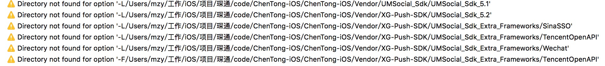

#iOS 常见错误解决

### 编译错误
1. **没有找到文件错误（clang: error: no such file or directory: '/xxx/xxx/xxx.m'	clang: error: no input files）**
> `Project > target > Build Phases > Compile Sources remove xxx.m`

2. **pod install很慢**
> 	`pod install --verbose --no-repo-update`
> 	`pod update --verbose --no-repo-update`

3. **clang: error: linker command failed with exit code 1 (use -v to see invocation)**
> 注意在pod里面导入了第三方包，然后在vendor重复导入了一遍将出现这个错误。
	
4. **ld: warning: directory not found for option “xxx/xxx”**
> 在`Project`->`Target`->`Build Settings`的`Library Search Paths`和`Framework Search Paths`中删掉编译报`warning`的路径即OK。具体错误如下图

#### Swift工程编译错误
1. **No such module 'xxx'**
> 更新`Xcode`到**7.3**，使用`swift 2.2`，可以解决这个问题。参考[这里](http://stackoverflow.com/questions/36336476/always-get-build-error-no-such-module-alamofire/36337666)


### Xcode Debug时的错误
1. 不显示debug的信息或者debug的信息显示不正确（没有预期的数值，但是运行到机器上却是正确的）
> 查看`Edit Scheme`中`Build Configuration`是否设置成了`Release`模式，将其修改成`Debug`模式

### 常见错误
1. process launch failed: timed out waiting for app to launch
> You are using distribution provisioning profile rather than development profile.见[这里](http://stackoverflow.com/questions/26032085/xcode-6-process-launch-failed-timed-out-trying-to-launch-app)


#### 分享编译错误
1. 集成umeng编译后报下面的错误

```
ndefined symbols for architecture arm64:
  "operator new[](unsigned long)", referenced from:
      +[WeChatApiUtil EncodeBase64:] in libWeChatSDK.a(WeChatApiUtil.o)
      +[WeChatApiUtil NsDataEncodeBase64:] in libWeChatSDK.a(WeChatApiUtil.o)
      +[WeChatApiUtil DecodeWithBase64:] in libWeChatSDK.a(WeChatApiUtil.o)
      +[WeChatApiUtil DecodeBase64:] in libWeChatSDK.a(WeChatApiUtil.o)
  "operator delete[](void*)", referenced from:
      +[WeChatApiUtil EncodeBase64:] in libWeChatSDK.a(WeChatApiUtil.o)
      +[WeChatApiUtil NsDataEncodeBase64:] in libWeChatSDK.a(WeChatApiUtil.o)
      +[WeChatApiUtil DecodeWithBase64:] in libWeChatSDK.a(WeChatApiUtil.o)
      +[WeChatApiUtil DecodeBase64:] in libWeChatSDK.a(WeChatApiUtil.o)
ld: symbol(s) not found for architecture arm64
clang: error: linker command failed with exit code 1 (use -v to see invocation)
```
解决办法：导入`libc++.dylib`。

### UI的一些异常
1. UI可以正常显示，但是对其进行（点击，滑动等）操作时，却操作不了。
> 检查Autolayout是否约束完整，比如，有没有设置最后一个View的底部距离其superView的约束。

2. UI不显示在屏幕上
> 检查是否在初始化的时候，为空的判断写错了。


